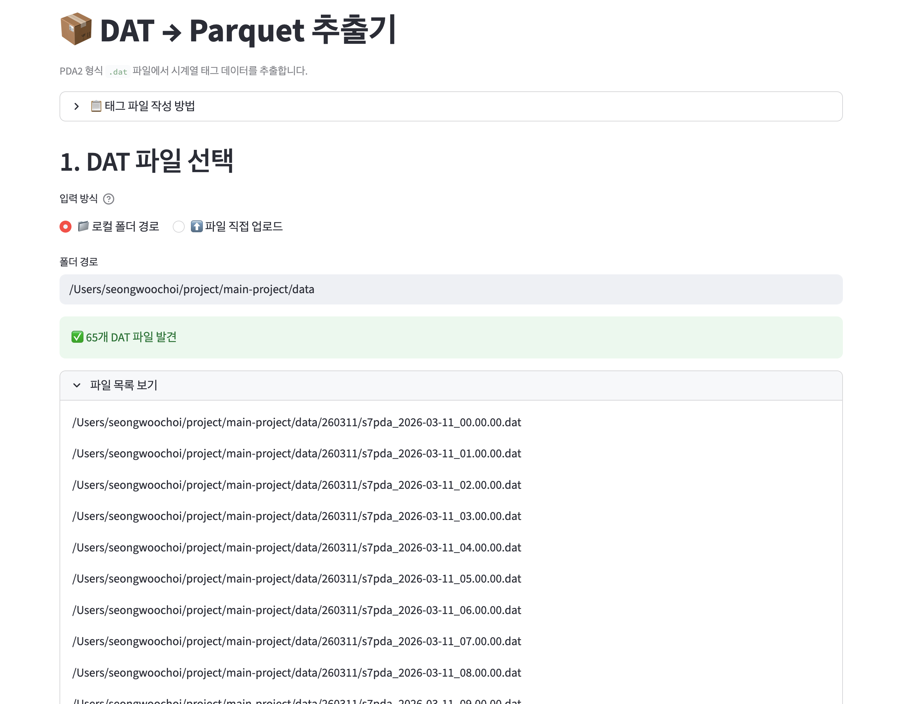
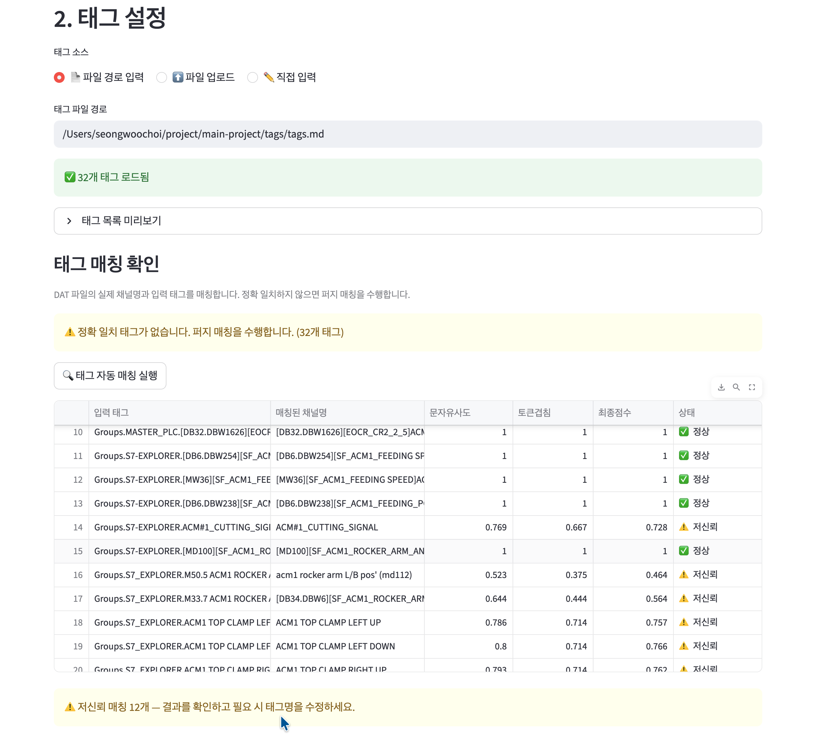
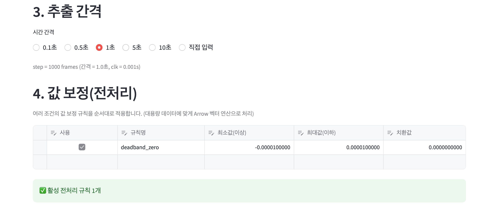
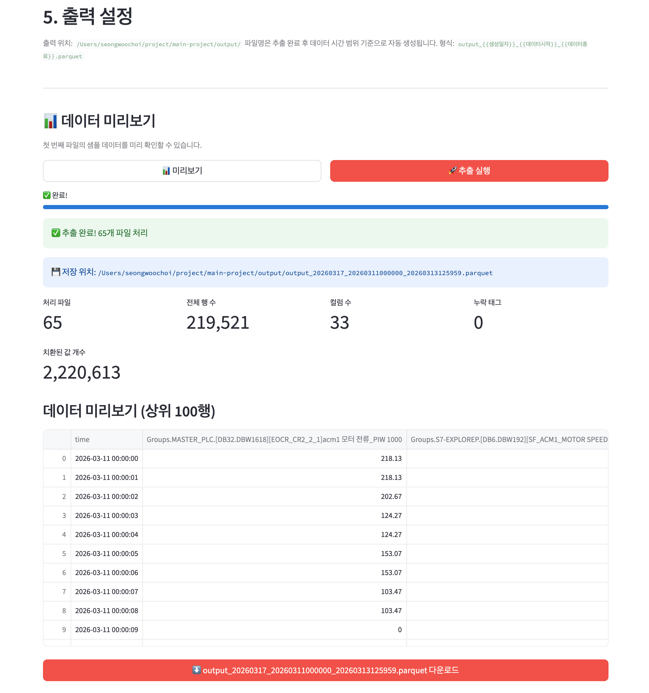

# IBA DAT → Parquet 추출기

PDA2 `.dat` 파일에서 원하는 태그를 추출하여 Parquet로 저장하는 도구입니다.

- 웹 UI 실행: `uv run streamlit run app.py`
- 핵심 기능: 태그 자동 매칭, 간격 추출(예: 1초), 값 보정(규칙 기반), 다중 DAT 병합 저장
- 파싱 방식: `decadr + RLE` (DLL 없이 순수 Python)

참고 구현 아이디어: https://github.com/ZisIsNotZis/iba.py

---

## 1. 실행 환경

- Python: `>=3.13`
- 의존성: `pyarrow`, `streamlit`
- 패키지 관리: `uv`

설치/동기화:

```bash
uv sync
```

---

## 2. 실사용 소스

- `app.py`
	- 운영용 Streamlit UI 진입점
- `script/extract_tags_to_parquet.py`
	- DAT 파싱 및 단일 파일 추출 핵심 로직
- `script/merge_all_data_to_parquet.py`
	- `data/` 전체 DAT를 단일 parquet로 병합
- `tags/tags.md`, `tags/tags_matched.txt`
	- 태그 입력/매핑 파일

참고/보조 스크립트(운영 필수 아님):

- `script/parse_pda_dat.py`
- `script/extract_tag_timeseries.py`
- `main.py`

---

## 3. 빠른 시작 (UI)

```bash
uv run streamlit run app.py
```

브라우저에서 `http://localhost:8501` 접속 후 아래 순서로 진행합니다.

1. DAT 파일(또는 폴더) 선택
2. 태그 파일 입력 (`tags/tags.md` 또는 `tags/tags_matched.txt`)
3. 자동 매칭 실행 및 결과 확인
4. 간격 선택 (예: 1초)
5. 값 보정 규칙 확인/수정
6. `미리보기`로 샘플 확인
7. `추출 실행`

출력 파일은 `output/` 폴더에 저장됩니다.

---

## 4. CLI 사용 예시

### 4-1) 단일 DAT 추출

```bash
uv run python script/extract_tags_to_parquet.py \
	data/260312/s7pda_2026-03-12_00.00.00.dat \
	--tag-file tags/tags_matched.txt \
	--step 1000 \
	--output output/single_tags_1s.parquet
```

### 4-2) 전체 DAT 병합 추출

```bash
uv run python script/merge_all_data_to_parquet.py \
	--data-dir data \
	--tag-file tags/tags_matched.txt \
	--step 1000 \
	--output output/all_data_tags_1s.parquet
```

`--step 1000`은 `clk=0.001` 기준 1초 간격입니다.

---

## 5. 중요한 로직 메모

최근 수정으로 아래 항목을 반영했습니다.

- 채널 타입(`$PDA_Typ`)별 디코딩 (`int16/uint16/int32/uint32/float`)
- 채널 샘플 주기(`$PDA_Tbase`) 반영

이 수정으로 특정 태그가 기존 결과에서 `NaN`으로 나오던 문제가 해결되었습니다.

---

## 6. 폴더 구조

```text
main-project/
├── app.py
├── script/
│   ├── extract_tags_to_parquet.py
│   ├── merge_all_data_to_parquet.py
│   ├── parse_pda_dat.py
│   └── extract_tag_timeseries.py
├── tags/
│   ├── tags.md
│   └── tags_matched.txt
├── data/
├── output/
├── pyproject.toml
└── README.md
```

---

## 7. 문제 해결

- `python: command not found` 또는 인터프리터 경로 이슈 시:
	- `uv run ...` 형태로 실행 권장
- Streamlit에서 코드 변경이 반영되지 않으면:
	- 앱 프로세스를 재시작 후 재실행


## 8. UI 미리보기




