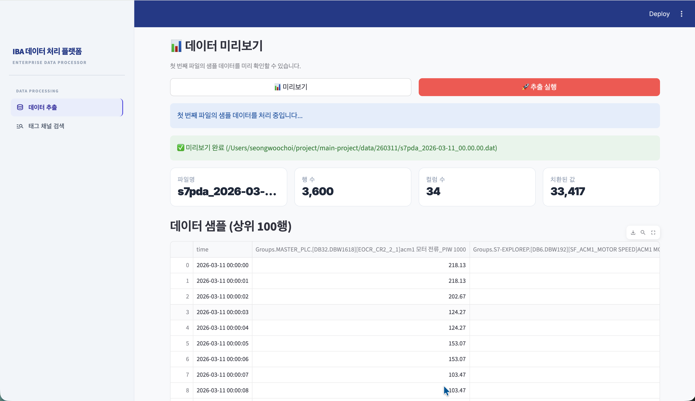
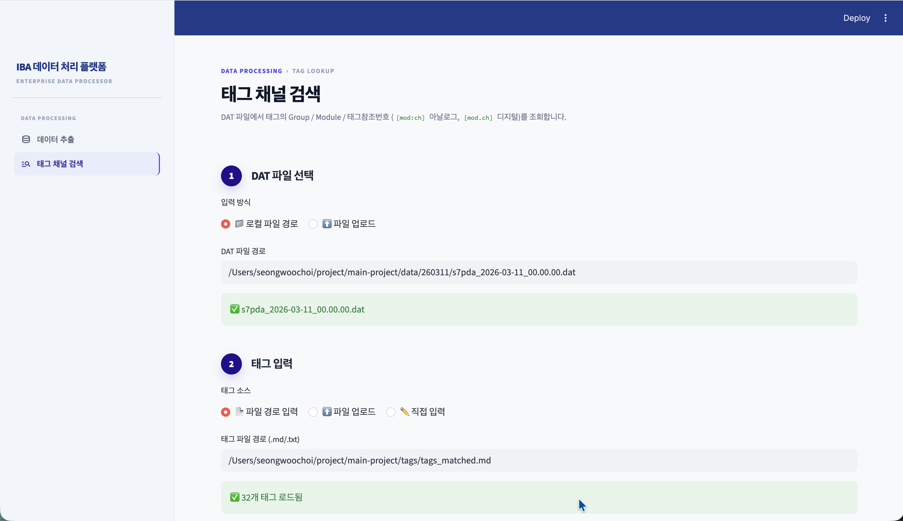
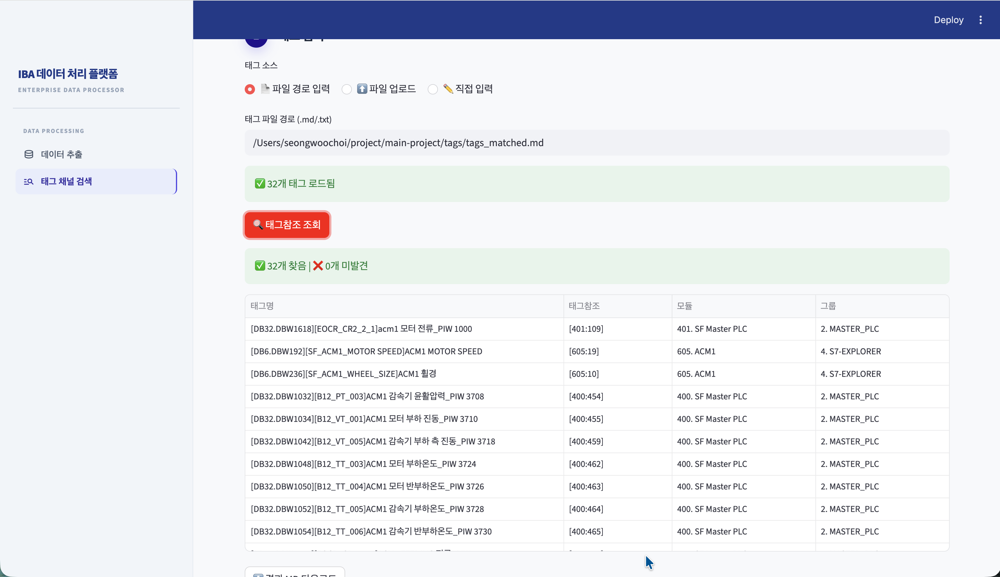

# IBA 데이터 처리 플랫폼

PDA2 `.dat` 파일에서 원하는 태그를 추출하여 Parquet로 저장하고, ibaPDA 채널의 위치(Group / Module / 태그참조번호)를 조회하는 Streamlit 웹 애플리케이션입니다.

- 웹 UI 실행: `uv run streamlit run app.py`
- 파싱 방식: `decadr + RLE` (DLL 없이 순수 Python)

참고 구현 아이디어: https://github.com/ZisIsNotZis/iba.py

---

## 1. 실행 환경

- Python: `>=3.13`
- 의존성: `pyarrow`, `streamlit`
- 패키지 관리: `uv`

```bash
uv sync
uv run streamlit run app.py
```

브라우저에서 `http://localhost:8501` 접속

---

## 2. 기능 구성

사이드바에서 두 페이지를 전환합니다.

### 데이터 추출 (DAT → Parquet)

| 섹션 | 내용 |
|------|------|
| 1. DAT 파일 선택 | 로컬 폴더 경로 또는 직접 업로드 |
| 2. 태그 설정 | 파일 경로·업로드·직접 입력 |
| 3. 태그 매칭 확인 | 채널 LIKE 검색, 퍼지 자동 매칭, 수동 수정 |
| 4. 추출 간격 | 샘플링 step 설정 (예: 1000 = 1초) |
| 5. 값 보정 | 범위 기반 치환 규칙 편집기 |
| 6. 출력 설정 | `output/` 폴더 자동 저장 + 브라우저 다운로드 |

### 태그 채널 검색

ibaPDA DAT 파일에서 태그의 Group / Module / 태그참조번호를 조회합니다.

- 아날로그 태그참조: `[모듈번호:N]` (콜론)
- 디지털 태그참조: `[모듈번호.N]` (점)
- 태그 목록 파일(`tags_matched.md`)을 일괄 조회하여 MD 테이블로 저장 가능

---

## 3. 파일 구조

```text
main-project/
├── app.py                          # Streamlit UI 진입점
├── script/
│   ├── extract_tags_to_parquet.py  # DAT 파싱 및 추출 핵심 로직
│   ├── merge_all_data_to_parquet.py
│   ├── parse_pda_dat.py            # DAT ASCII 메타데이터 파서
│   ├── find_channel_location.py    # Group/Module/태그참조 인덱스 빌더
│   └── resolve_tags.py             # 태그 목록 일괄 태그참조 조회
├── tags/
│   ├── tags.md                     # 태그 정의 파일
│   ├── tags_matched.md             # iba 추출 채널명 목록 (Python list)
│   └── tags_resolved.md            # 태그참조 조회 결과 (자동 생성)
├── data/                           # DAT 파일 폴더
├── output/                         # 추출 결과 Parquet
├── pyproject.toml
└── README.md
```

---

## 4. 빠른 시작 — 데이터 추출 (UI)

```bash
uv run streamlit run app.py
```

1. **DAT 파일 선택** — 폴더 경로 또는 파일 업로드
2. **태그 설정** — `tags/tags.md` 경로 입력 또는 직접 입력
3. **태그 매칭 확인** — 채널명 검색으로 후보 확인 후 자동 매칭 실행
4. **추출 간격** — step 설정 (1000 → 1초)
5. **값 보정** — deadband 등 치환 규칙 확인/수정
6. **미리보기** 확인 후 **추출 실행**

출력 파일: `output/output_{생성일자}_{데이터시작}_{데이터종료}.parquet`

---

## 5. 빠른 시작 — 태그 채널 검색 (UI)

1. **DAT 파일 선택** — 기본값: `data/260311/s7pda_2026-03-11_00.00.00.dat`
2. **태그 입력** — 파일(`tags_matched.md`) 또는 직접 입력
3. **조회** — Group / Module / 태그참조번호 테이블 확인
4. **MD 다운로드** — 결과를 `tags/tags_resolved.md`로 저장

---

## 6. CLI 사용 예시

### 단일 DAT 추출

```bash
uv run python script/extract_tags_to_parquet.py \
    data/260312/s7pda_2026-03-12_00.00.00.dat \
    --tag-file tags/tags_matched.txt \
    --step 1000 \
    --output output/single_tags_1s.parquet
```

### 전체 DAT 병합 추출

```bash
uv run python script/merge_all_data_to_parquet.py \
    --data-dir data \
    --tag-file tags/tags_matched.txt \
    --step 1000 \
    --output output/all_data_tags_1s.parquet
```

### 태그 채널 위치 CLI 조회

```bash
# 단일 채널 검색
uv run python script/find_channel_location.py \
    data/260311/s7pda_2026-03-11_00.00.00.dat "ROCKER ARM"

# 태그 목록 일괄 조회 → MD 저장
uv run python script/resolve_tags.py \
    data/260311/s7pda_2026-03-11_00.00.00.dat \
    --tags tags/tags_matched.md \
    --out tags/tags_resolved.md
```

---

## 7. 태그참조번호 규칙 (ibaPDA)

| 채널 유형 | 형식 | 예시 |
|-----------|------|------|
| 아날로그 | `[모듈번호:N]` | `[605:8]` |
| 디지털 | `[모듈번호.N]` | `[605.11]` |

- `N`은 해당 모듈 내 아날로그/디지털 각각 0-based 순번 (channel_index 오름차순)

---

## 8. 문제 해결

- `python: command not found` — `uv run ...` 형태로 실행
- Streamlit 코드 변경 미반영 — 앱 프로세스 재시작
- 태그 `NOT FOUND` — DAT 파일 내 채널명과 태그명 불일치, 태그 채널 검색 페이지에서 부분 검색으로 후보 확인

---

## 9. UI 미리보기

### 데이터 추출




### 태그 채널 검색

